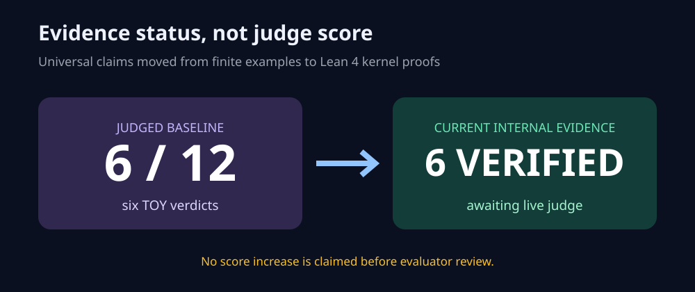
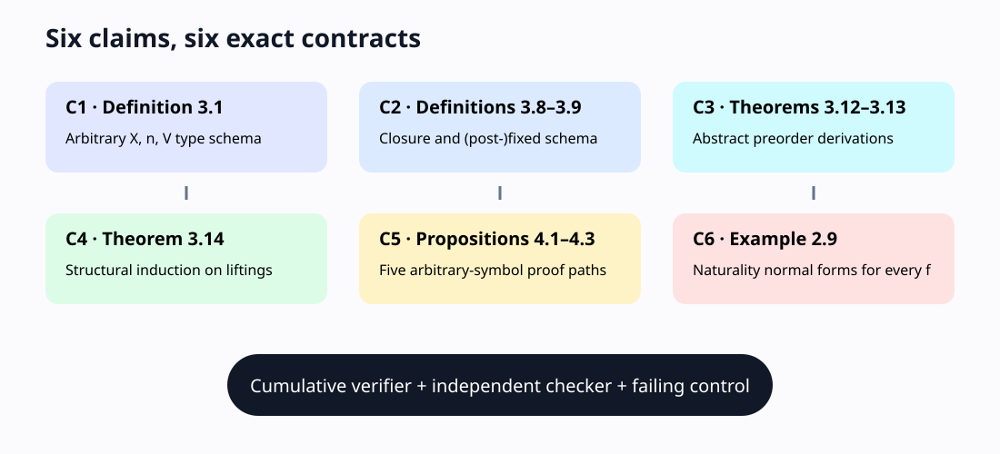
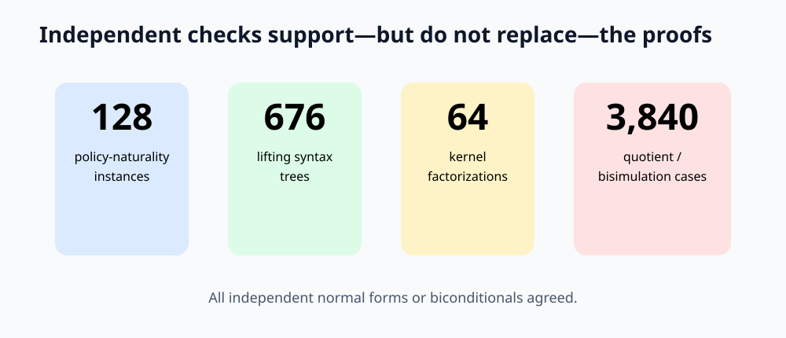
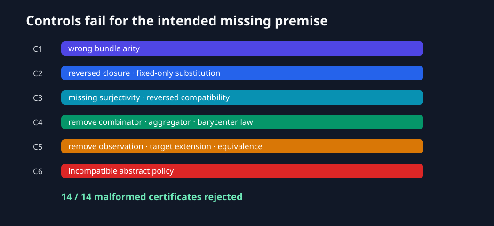
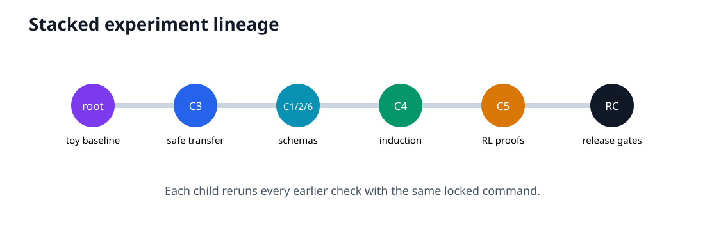

# From toy instances to Lean 4 kernel proofs



This reproduction asks a narrow question: can each selected universal claim in
*Compositional Behavioral Semantics for State Abstraction in Reinforcement
Learning* be checked without pretending that a tiny MDP proves a theorem? The
answer is now yes for the six selected claims at the Set-level formalization
scope, subject to the explicit premises and limitations below. The live
evaluator has not reviewed this revision, so 6/12 remains the only judged score.

## What changed

The judged Space exhaustively checked Boolean predicates on three or four
states. Those examples were correct, but they could only corroborate universal
statements. The current implementation defines arbitrary objects and maps in
Lean 4, asks the Lean kernel to check 11 generic theorems, audits every theorem's
logical dependencies, and verifies that six premise/type-breaking mutations
fail compilation. The former symbolic and finite checks remain secondary
regressions.



The fixed cumulative command is:

```bash
uv run --frozen python repro/src/verify.py && uv run --frozen python repro/src/publication_gate.py
```

It uses Python 3.12 and Lean 4.32.0 from pinned repository inputs. Scientific
formalization commit: `78ef92c8ea1091c86ae87fde314eff6e34698a1e`.
The successful formal run was
`081c66c6-86a4-420f-ada5-354de4cb7e6c`.

## Claim-by-claim evidence

| Claim | Paper statement tested | Primary route | Independent route | Result |
|---|---|---|---|---|
| 1 | Definition 3.1: every `n`-ary bundle has type `X^n → V` for an `F`-coalgebra `t_X : X → FX` | Lean types and two generic totality theorems | wrong-arity Lean mutation fails | VERIFIED |
| 2 | Definitions 3.8–3.9: `T_X = t_X* ∘ λ_X`; behavioral structures are post-fixed or fixed | Generic Lean closure and fixed-to-post-fixed theorem | reversed inequality mutation fails | VERIFIED |
| 3 | Theorems 3.12–3.13: pullback reflects and pushforward preserves post-fixed points under the stated hypotheses | Three kernel-checked order-theoretic theorems | missing-surjectivity mutation fails | VERIFIED |
| 4 | Theorem 3.14: zero transfers quantitative to logical liftings under all algebra-homomorphism laws | Lean structural induction over all four constructors | missing-homomorphism mutation fails | VERIFIED |
| 5 | Propositions 4.1–4.3: next-observation, model irrelevance, and bisimulation quotient characterizations | Five generic theorems using an abstract probability functor and actual quotients | missing-kernel-condition mutation fails | VERIFIED |
| 6 | Example 2.9: policy closure is natural for every set map `f : X → Y` | Lean definitional-equality proof for arbitrary `f` | incompatible-policy mutation fails | VERIFIED |

The exact source audit records the ar5iv SHA-256
`aed1b2a2746d622e320cf34b8302381f0fa8edd0fbba0f8b4e937f67fba8987a`
and arXiv source SHA-256
`49b5caabba01904db0c268d7528c3785bc20175791feefea22d4896c8ec5039a`.

## Why the checks are non-circular

No proof uses a state count, tolerance, horizon, or sample budget chosen from
the target identity. Every theorem quantifies over arbitrary Lean types and
maps; Claim 4 proceeds by structural induction. Finite enumeration is
deliberately separate and cannot make a Lean theorem compile.



The negative controls are premise-specific compilable source files. Each
removes or contradicts a paper requirement; `lean_gate.py` requires Lean to
exit nonzero with the intended type/assumption error.



## Important limitations

Claim 3 verifies the order-theoretic transfer step while treating the paper's
separately stated lifting-compatibility lemmas as premises. Claim 4 covers every
finite expression generated by the paper's three operator constructors, not
unstated operators. Claim 5's Proposition 4.2 reverse direction uses the
standard nonempty-MDP extension from the encoder image to representation states
outside that image; this convention is stated rather than hidden. Claim 6's
direct 128-case enumeration is only a checker for the universal symbolic
normalization.

This mechanizes the six selected claims at the paper's Set-level presentation;
it is not a formalization of the complete categorical development or every
appendix lemma. That scope and evaluator interpretation are why the projected
score is a forecast, not a guarantee.

## Compute and lineage



The Lean build had uncertain setup time, so it ran on Hugging Face
`cpu-upgrade`. Estimate: 2 cores. Actual allocation: 64 visible logical CPUs;
Lean worker threads: 1. The verifier completed in 29.088961 seconds. No GPU was
used. HF billing cost was not exposed in the run record.

The important experiment branches are
[`judged-finite-instance-baseline`](https://github.com/MachineLearning-Nerd/icml26-repro-kovefbSXbQ-behavioral-state-abstraction/tree/orx/judged-finite-instance-baseline),
[`c3-symbolic-safe-transfer-certificate`](https://github.com/MachineLearning-Nerd/icml26-repro-kovefbSXbQ-behavioral-state-abstraction/tree/orx/c3-symbolic-safe-transfer-certificate),
[`c1-c2-c6-symbolic-definition-and-naturality-cert`](https://github.com/MachineLearning-Nerd/icml26-repro-kovefbSXbQ-behavioral-state-abstraction/tree/orx/c1-c2-c6-symbolic-definition-and-naturality-cert),
[`c4-structural-zero-predicate-certificate`](https://github.com/MachineLearning-Nerd/icml26-repro-kovefbSXbQ-behavioral-state-abstraction/tree/orx/c4-structural-zero-predicate-certificate),
and [`c5-rl-proposition-proof-certificates`](https://github.com/MachineLearning-Nerd/icml26-repro-kovefbSXbQ-behavioral-state-abstraction/tree/orx/c5-rl-proposition-proof-certificates).
The kernel-proof milestone is
[`lean-4-kernel-proofs-for-all-six-claims`](https://github.com/MachineLearning-Nerd/icml26-repro-kovefbSXbQ-behavioral-state-abstraction/tree/orx/lean-4-kernel-proofs-for-all-six-claims).

## Assessment

All six internal contracts are **VERIFIED** and the cumulative regression suite
passes. A conservative projected score range is **8–12/12**; the
best-supported possible score is **12/12**, strictly as a forecast. The existing
6/12 live score remains authoritative until the judge evaluates the published
Space revision.
